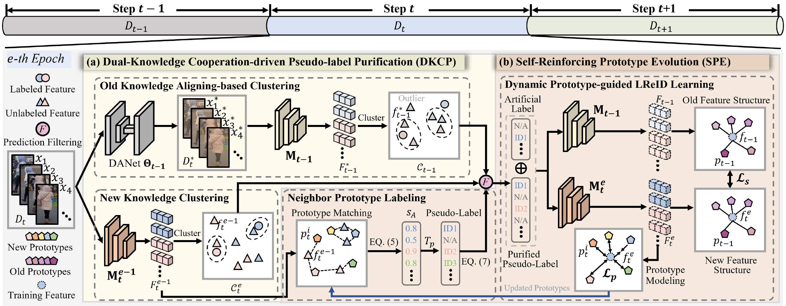
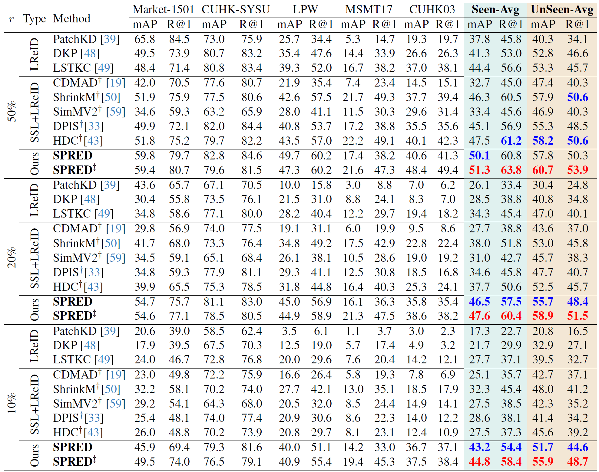

# [ICCV2025] Self-Reinforcing Prototype Evolution with Dual-Knowledge Cooperation for Semi-Supervised Lifelong Person Re-Identification 

<div align="center">

<div>
      Kunlun Xu<sup>1</sup>&emsp; Fan Zhuo<sup>1</sup>&emsp;  Jiangmeng Li<sup>2</sup>&emsp; Xu Zou<sup>3</sup>&emsp; Jiahuan Zhou<sup>1*</sup>
  </div>
<div>

  <sup>1</sup>Wangxuan Institute of Computer Technology, Peking University&emsp; <sup>2</sup>University of Chinese Academy of Sciences&emsp; <sup>2</sup>School of Artificial Intelligence and Automation, Huazhong University of Science and Technology

</div>
</div>
<p align="center">
<a href='https://arxiv.org/pdf/2507.01884'></a>
  <a href="https://github.com/zhoujiahuan1991/ICCV2025-SPRED"></a>
</p>

The *official* repository for  [Self-Reinforcing Prototype Evolution with Dual-Knowledge Cooperation for Semi-Supervised Lifelong Person Re-Identification](https://arxiv.org/abs/2507.01884).




## Installation
```shell
conda create -n IRL python=3.7
conda activate IRL
pip install torch==1.13.1+cu117 torchvision==0.14.1+cu117 torchaudio==0.13.1 --extra-index-url https://download.pytorch.org/whl/cu117
pip install -r requirement.txt
python setup.py develop
```
## Prepare Datasets
The person re-identification datasets excepted for **LPW_s2** can be download following [DASK](https://github.com/zhoujiahuan1991/AAAI2025-LReID-DASK).

Since the DukeMTMC-reid dataset, which is widely used in lifelong person re-identification (LReID), has ben withdrawn by the authors, we have constructed an alternative datset LPW_s2 to faciliate the development of LReID. The **LPW_s2** arranged in Market-1501 format can be downloaded from the following links:

[Baidu Yun](https://pan.baidu.com/s/14NDh1TFB6l6Uvb5NSfh3Yg?pwd=2047)

[Google Drive](https://drive.google.com/file/d/1fq9AvseqRew20Cp8drMGoWuZ1hNdPPZK/view?usp=sharing)


Then unzip them and rename them under the directory like
```
PRID
├── CUHK01
│   └──..
├── CUHK02
│   └──..
├── CUHK03
│   └──..
├── CUHK-SYSU
│   └──..
├── LPW_s2
│   └──..
├── grid
│   └──..
├── i-LIDS_Pedestrain
│   └──..
├── MSMT17_V2
│   └──..
├── Market-1501
│   └──..
├── prid2011
│   └──..
├── SenseReID
│   └──..
└── viper
    └──..
```
## Quick Start
### Training DANet
```shell
`CUDA_VISIBLE_DEVICES=1 python train_transfer.py --logs-dir transfer_model  --data-dir /path/to/PRID`
```

### SPRED Training 
Training + evaluation:
```shell
sh work.sh
```
### SPRED$^\ddag$ Training 
Training + evaluation:
```shell
sh work_dual-aug.sh
```

## Results
The following results were obtained with a single NVIDIA 4090 GPU:



## Citation
If you find this code useful for your research, please cite our paper.
@inproceedings{tao2023adanic,
  title={Self-Reinforcing Prototype Evolution with Dual-Knowledge Cooperation for Semi-Supervised Lifelong Person Re-Identification},
  author={Xu, Kunlun and Zhuo, Fan and Li, Jiangmeng and Zou, Xu and Jiahuan Zhou},
  booktitle={Proceedings of the IEEE/CVF International Conference on Computer Vision},
  year={2025}
}


### We have conducted a series of research in Lifelong Person Re-Identification as follows.

#### Long Short-Term Knowledge Decomposition, Rectification and Consolidation:
@article{xu2025long,
  title={Long Short-Term Knowledge Decomposition and Consolidation for Lifelong Person Re-Identification},
  author={Xu, Kunlun and Liu, Zichen and Zou, Xu and Peng, Yuxin and Zhou, Jiahuan},
  journal={IEEE Transactions on Pattern Analysis and Machine Intelligence},
  year={2025},
  publisher={IEEE}
}

@inproceedings{xu2024lstkc,
  title={LSTKC: Long Short-Term Knowledge Consolidation for Lifelong Person Re-identification},
  author={Xu, Kunlun and Zou, Xu and Zhou, Jiahuan},
  booktitle={Proceedings of the AAAI Conference on Artificial Intelligence},
  volume={38},
  number={14},
  pages={16202--16210},
  year={2024}
}

#### Imgae-level Distribution Modeling and Transfer:
@inproceedings{xu2025dask,
  title={Dask: Distribution rehearsing via adaptive style kernel learning for exemplar-free lifelong person re-identification},
  author={Xu, Kunlun and Jiang, Chenghao and Xiong, Peixi and Peng, Yuxin and Zhou, Jiahuan},
  booktitle={Proceedings of the AAAI Conference on Artificial Intelligence},
  volume={39},
  number={9},
  pages={8915--8923},
  year={2025}
}

#### Feature-level Distribution Modeling and Prototyping:
@inproceedings{xu2024distribution,
  title={Distribution-aware Knowledge Prototyping for Non-exemplar Lifelong Person Re-identification},
  author={Xu, Kunlun and Zou, Xu and Peng, Yuxin and Zhou, Jiahuan},
  booktitle={Proceedings of the IEEE/CVF Conference on Computer Vision and Pattern Recognition},
  pages={16604--16613},
  year={2024}
}


#### Lifelong Learning with Label Noise: 
@inproceedings{xu2024mitigate,
  title={Mitigate Catastrophic Remembering via Continual Knowledge Purification for Noisy Lifelong Person Re-Identification},
  author={Xu, Kunlun and Zhang, Haozhuo and Li, Yu and Peng, Yuxin and Zhou, Jiahuan},
  booktitle={Proceedings of the 32nd ACM International Conference on Multimedia},
  pages={5790--5799},
  year={2024}
}

#### Prompt-guided Adaptive Knowledge Consolidation:
@article{li2024exemplar,
  title={Exemplar-Free Lifelong Person Re-identification via Prompt-Guided Adaptive Knowledge Consolidation},
  author={Li, Qiwei and Xu, Kunlun and Peng, Yuxin and Zhou, Jiahuan},
  journal={International Journal of Computer Vision},
  pages={1--16},
  year={2024},
  publisher={Springer}
}

#### Compatible Lifelong Learning:
@inproceedings{cui2024learning,
  title={Learning Continual Compatible Representation for Re-indexing Free Lifelong Person Re-identification},
  author={Cui, Zhenyu and Zhou, Jiahuan and Wang, Xun and Zhu, Manyu and Peng, Yuxin},
  booktitle={Proceedings of the IEEE/CVF Conference on Computer Vision and Pattern Recognition},
  pages={16614--16623},
  year={2024}
}

## Acknowledgement
Our code is based on the PyTorch implementation of [LSTKC](https://github.com/zhoujiahuan1991/AAAI2024-LSTKC) and [CoP](https://github.com/vimar-gu/ColorPromptReID).

## Contact

For any questions, feel free to contact us (xkl@stu.pku.edu.cn).

Welcome to our [Laboratory Homepage](http://www.icst.pku.edu.cn/mipl/home/) and [OV<sup>3</sup> Lab](https://zhoujiahuan1991.github.io/) for more information about our papers, source codes, and datasets.

